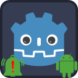
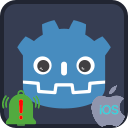

<p align="center">
	
	&nbsp;&nbsp;&nbsp;&nbsp;&nbsp;&nbsp;
	
</p>

---

#  Godot Notification Scheduler Plugin

Notification Scheduler Plugin provides a unified GDScript interface for the scheduling of local notifications on the Android and iOS platforms.

_This plugin has been moved under the umbrella of [Godot SDK Integrations](https://github.com/godot-sdk-integrations) organization in Github. Previously, the plugin was placed under three separate repositories: [Android](https://github.com/cengiz-pz/godot-android-notification-scheduler-plugin), [iOS](https://github.com/cengiz-pz/godot-ios-notification-scheduler-plugin), and [addon interface](https://github.com/cengiz-pz/godot-notification-scheduler-addon)._

<br/>

##  Installation
_Before installing this plugin, make sure to uninstall any previous versions of the same plugin._

_If installing both Android and iOS versions of the plugin in the same project, then make sure that both versions use the same addon interface version._

There are 2 ways to install the `Notification Scheduler` plugin into your project:
- Through the Godot Editor's AssetLib
- Manually by downloading archives from Github

###  Installing via AssetLib
Steps:
- search for and select the `Notification Scheduler` plugin in Godot Editor
- click `Download` button
- on the installation dialog...
	- keep `Change Install Folder` setting pointing to your project's root directory
	- keep `Ignore asset root` checkbox checked
	- click `Install` button
- enable the plugin via the `Plugins` tab of `Project->Project Settings...` menu, in the Godot Editor

####  Installing both Android and iOS versions of the plugin in the same project
When installing via AssetLib, the installer may display a warning that states "_[x number of]_ files conflict with your project and won't be installed." You can ignore this warning since both versions use the same addon code.

###  Installing manually
Steps:
- download release archive from Github
- unzip the release archive
- copy to your Godot project's root directory
- enable the plugin via the `Plugins` tab of `Project->Project Settings...` menu, in the Godot Editor


##  Usage
Add a `NotificationScheduler` node to your scene and follow the following steps:
- Register listeners for the following signals emitted from the `NotificationScheduler` node
	- `notification_opened` - when user taps notification item
	- `permission_granted`
	- `permission_denied`
- At startup, using the `NotificationScheduler` node to check that the application has permissions to post notifications:
```
	$NotificationScheduler.has_post_notifications_permission()
```
- If the application doesn't have permissions to post notifications, then request permission using the `NotificationScheduler` node:
```
	$NotificationScheduler.request_post_notifications_permission()
```
- `permission_granted` signal will be emitted when the application receives the permissions
> On Android, apps that target Android 13 or higher can ask for notification permission as many times as they want until the user explicitly denies the permission twice. If the user targets Android 12 or lower, the app can ask for permission as many times as it wants until the user denies the permission once. If the user denies the permission twice, the app can't ask again unless the user reinstalls the app
- After user has denied the request, you can ask to turn on notification permission manually and send them to App_Info screen using the `NotificationScheduler` node:(Best Practice: Don't promt users automatically, insted keep a button in settings to toggle notifications)
```
	$NotificationScheduler.open_app_info_settings()
```
- Create a notification channel using the `NotificationScheduler` node:
```
	var __result = $NotificationScheduler.create_notification_channel(
		NotificationChannel.new()
			.set_id("my_channel_id")
			.set_name("My Channel Name")
			.set_description("My channel description")
			.set_importance(NotificationChannel.Importance.DEFAULT))
```
_Note: `create_notification_channel()` method returns `OK` if channel has been created successfully, `ERR_UNAVAILABLE` if plugin was not initialized, `ERR_INVALID_DATA` if `NotificationChannel` data is invalid, and `ERR_ALREADY_EXISTS` if a channel with the same ID already exists._
- Build `NotificationData` object:
```
	var my_notification_data = NotificationData.new()
	my_notification_data.set_id(__notification_id).\
			set_channel_id("my_channel_id").\
			set_title("My Notification Title").\
			set_content("My notification content").\
			set_small_icon_name("ic_name_of_the_icon_that_you_generated").\
			set_delay(my_delay_in_seconds)
```
- Schedule notification using the `NotificationScheduler` node:
```
	$NotificationScheduler.schedule(
			my_notification_data
		)
```
- _`NotificationData`'s `set_interval(interval_in_seconds)` method can be used for scheduling repeating notifications._
- _`NotificationData`'s `set_deeplink(data)` method can be used for delivering URI data along with the notification._
	- _The [Deeplink Plugin](https://github.com/cengiz-pz/godot-android-deeplink-plugin) can then be used to process the URI data._

###  Other Available Methods
- `cancel(notification_id)`
- `get_notification_id()` - alternative way to get the ID of the last opened notification.

<br/><br/>

---

#  Android Notification Scheduler Plugin

<p align="center">
	
</p>


## [Android-specific Documentation](android/README.md)
## [AssetLib Entry](https://godotengine.org/asset-library/asset/2547)

<br/><br/>

---

#  iOS Notification Scheduler Plugin

<p align="center">
	
</p>

## [iOS-specific Documentation](ios/README.md)
## [AssetLib Entry](https://godotengine.org/asset-library/asset/3186)

<br/><br/>

---
#  All Plugins

| Plugin | Android | iOS |
| :---: | :--- | :--- |
| [Notification Scheduler](https://github.com/godot-sdk-integrations/godot-notification-scheduler) | ✅ | ✅ |
| [Admob](https://github.com/godot-sdk-integrations/godot-admob) | ✅ | ✅ |
| [Deeplink](https://github.com/godot-sdk-integrations/godot-deeplink) | ✅ | ✅ |
| [Share](https://github.com/godot-sdk-integrations/godot-share) | ✅ | ✅ |
| [In-App Review](https://github.com/godot-sdk-integrations/godot-inapp-review) | ✅ | ✅ |

<br/><br/>

---
#  Credits

Developed by [Cengiz](https://github.com/cengiz-pz)

iOS part is based on: [Godot iOS Plugin Template](https://github.com/cengiz-pz/godot-ios-plugin-template)

Original repository: [Godot Notification Scheduler Plugin](https://github.com/godot-sdk-integrations/godot-notification-scheduler)
