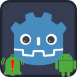

<p align="center">
	
</p>

---
#  Notification Scheduler Plugin
Notification Scheduler Plugin allows scheduling of local notifications on the Android platform.

_For iOS version, visit https://github.com/cengiz-pz/godot-ios-notification-scheduler-plugin ._

##  Prerequisites
Follow instructions on the following page to create a custom Android gradle build
- [Create custom Android gradle build](https://docs.godotengine.org/en/stable/tutorials/export/android_gradle_build.html)

Prior to using this plugin, a notification icon should be generated. For instructions please visit the following link:
- https://developer.android.com/studio/write/create-app-icons#notification


##  Notification icon
The plugin contains a default set of notification icons and the small icon name is set to `ic_default_notification` by default. The icons are copied to the target project's `res://assets/NotificationSchedulerPlugin` directory when the plugin is installed. At export time, every resource under `res://assets/NotificationSchedulerPlugin` directory is copied under the project's `res://android/build/res` directory. Keeping icon resources outside the `res://android/build` directory is essential for preventing loss of data when upgrading the Android build template for the project.

In order to use custom notification icons, copy your custom notification icons to your project's `res://assets/NotificationSchedulerPlugin` directory and specify the name of the custom icon set using `NotificationData`'s `set_small_icon_name()` method.

###  Generating notification icons using Android Studio
 `Android Studio`'s `Image Asset Studio` can be used to generate custom set of notification icons for your project.

Steps:

- Open your Godot project's `android/build` directory in Android Studio
- Wait for it to fully load
- Right click on `res` folder and select `New -> Image Asset` from the context menu
- On the `Asset Studio` wizard
	- Set `Icon type` to `Notification Icons`
	- Enter a the name of your notification icon (ie. `ic_my_notification`)
	- Configure your icon
	- Click `Next` button
	- Click `Finish` button to confirm
- The following new directories should have been created under your Godot project's `android/build/res` directory:
	- `drawable-anydpi`
	- `drawable-xxhdpi`
	- `drawable-xhdpi`
	- `drawable-hdpi`
	- `drawable-mdpi`
- Copy these directories and their content under your project's `res://assets/NotificationSchedulerPlugin` directory.
- Make sure you use the name you specified for your icons when initializing notifications:
	- `my_notification_data.set_small_icon_name("<your_notification_icon_name_here>")`

##  Troubleshooting

### ADB logcat
`adb logcat` is one of the best tools for troubleshooting unexpected behavior
- use `$> adb logcat | grep 'godot'` on Linux
	- `adb logcat *:W` to see warnings and errors
	- `adb logcat *:E` to see only errors
	- `adb logcat | grep 'godot|somethingElse'` to filter using more than one string at the same time
- use `#> adb.exe logcat | select-string "godot"` on powershell (Windows)


### No small icon found for notification
For example, there will be an error similar to the following visible in `adb logcat` if small icon resource files have not been added to the project.

```
 E FATAL EXCEPTION: main
 Process: org.godotengine.notification:godot_notification_receiver, PID: 12214
 java.lang.RuntimeException: Unable to start receiver org.godotengine.plugin.android
 notification.NotificationReceiver: java.lang.IllegalArgumentException: Invalid notification (no valid small icon)
```

Also check out:
https://docs.godotengine.org/en/stable/tutorials/platform/android/android_plugin.html#troubleshooting


### Android app settings
Some Android OS flavors will automatically adjust applications' power consumption settings. Messages may not be delivered when this setting is set to "optimized" or "restricted," especially if the app is closed.

Check your application's power consumption settings at:

```
Settings -> Apps -> Your App -> Battery
```

### Other troubleshooting sources
Also check out:
https://docs.godotengine.org/en/stable/tutorials/platform/android/android_plugin.html#troubleshooting

<br/><br/><br/>

---
#  Credits
Developed by [Cengiz](https://github.com/cengiz-pz)

Original repository: [Godot Android Notification Scheduler Plugin](https://github.com/cengiz-pz/godot-android-notification-scheduler-plugin)
