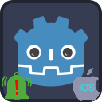

<p align="center">
	
	&nbsp;&nbsp;&nbsp;&nbsp;&nbsp;&nbsp;
	
</p>

---

#  Godot Notification Scheduler Plugin

A unified GDScript interface for scheduling **local notifications** on **Android** and **iOS**.

**Features:**
- Schedule local notifications with customizable titles, content, and delays.
- Schedule repeating notifications with intervals.
- Manage notification channels and badges.
- Handle permissions and user interactions via signals.

---

##  Table of Contents
- [Installation](#installation)
- [Usage](#usage)
- [Signals](#signals)
- [Error Codes](#error-codes)
- [Platform-Specific Notes](#platform-specific-notes)
- [Links](#links)
- [All Plugins](#all-plugins)
- [Credits](#credits)
- [Contributing](#contributing)

---

<a name="installation"></a>

##  Installation

**Uninstall previous versions** before installing.
If using both Android & iOS, ensure **same addon interface version**.

**Options:**
1. **AssetLib**
	- Search for `Notification Scheduler`
	- Click `Download` → `Install`
	- Install to project root, `Ignore asset root` checked
	- Enable via **Project → Project Settings → Plugins**
	- Ignore file conflict warnings when installing both versions
2. **Manual**
	- Download release from GitHub
	- Unzip to project root
	- Enable via **Plugins** tab

---

<a name="usage"></a>

##  Usage

1. Add a **NotificationScheduler** node to your scene.
2. Connect [signals](#signals):
	- `initialization_completed`
	- `notification_opened`
	- `notification_dismissed`
	- `permission_granted`
	- `permission_denied`
3. Check permission:
	```gdscript
	if not $NotificationScheduler.has_post_notifications_permission():
		$NotificationScheduler.request_post_notifications_permission()
	```
4. To send user to App Info (manual enable):
	```gdscript
	$NotificationScheduler.open_app_info_settings()
	```
5. Create a notification channel:
	```gdscript
	var res = $NotificationScheduler.create_notification_channel(
		 NotificationChannel.new()
			  .set_id("my_channel_id")
			  .set_name("My Channel Name")
			  .set_description("My channel description")
			  .set_importance(NotificationChannel.Importance.DEFAULT))
	```
6. Build & schedule notification:
	```gdscript
	var data = NotificationData.new()
		 .set_id(1)
		 .set_channel_id("my_channel_id")
		 .set_title("My Title")
		 .set_content("My content")
		 .set_small_icon_name("ic_custom_icon")
		 .set_delay(10)

	var res = $NotificationScheduler.schedule(data)
	```

**Other Methods:**
- `cancel(id)` – cancel before opened/dismissed
- `set_badge_count(count)` – set/remove app icon badge (iOS-only)
- `get_notification_id()` – get ID of last opened notification

---

<a name="signals"></a>

##  Signals

- `initialization_completed()`: Emitted when the plugin is initialized.
- `notification_opened(notification_id: int)`: Emitted when a user taps notification.
- `notification_dismissed(notification_id: int)`: Emitted when a user dismisses notification.
- `permission_granted(permission_name: String)`: Emitted when permission is granted.
- `permission_denied(permission_name: String)`: Emitted when permission is denied.

---

<a name="error-codes"></a>

##  Error Codes

| Constant              | Value | Description                             |
|-----------------------|-------|-----------------------------------------|
| `ERR_ALREADY_EXISTS`  | `1`   | Channel ID already exists               |
| `ERR_INVALID_DATA`    | `2`   | Invalid notification/channel data       |
| `ERR_UNAVAILABLE`     | `3`   | Not supported on current platform       |
| `ERR_UNCONFIGURED`    | `4`   | Plugin not initialized                  |
| `OK`                  | `0`   | Success                                 |

---

<a name="platform-specific-notes"></a>

##  Platform-Specific Notes

### Android
- **Default icon:** `ic_default_notification` in `res://assets/NotificationSchedulerPlugin`
- **Custom icon:**
  1. Generate via Android Studio → **Image Asset Studio** → **Notification Icons**
  2. Copy generated drawables into `res://assets/NotificationSchedulerPlugin`
  3. Use `set_small_icon_name("icon_name")`
- **Troubleshooting:**
  - Logs: `adb logcat | grep 'godot'` (Linux), `adb.exe logcat | select-string "godot"` (Windows)
  - No small icon error: ensure icons exist in assets directory.
  - Battery restrictions: check **Settings → Apps → Your App → Battery**.

### iOS
- Set notification icons in **Project → Export → iOS**.
- System limits:
	- Max repeating notifications: 64
	- Min interval: 60 seconds
- View XCode logs while running the game for troubleshooting.
- See [Godot iOS Export Troubleshooting](https://docs.godotengine.org/en/stable/tutorials/export/exporting_for_ios.html#troubleshooting).

---

<a name="links"></a>

#  Links

- [AssetLib Entry Android](https://godotengine.org/asset-library/asset/2547)
- [AssetLib Entry iOS](https://godotengine.org/asset-library/asset/3186)

---

<a name="all-plugins"></a>

#  All Plugins

| Plugin | Android | iOS | Free | Open Source | License |
| :--- | :---: | :---: | :---: | :---: | :---: |
| [Notification Scheduler](https://github.com/godot-sdk-integrations/godot-notification-scheduler) | ✅ | ✅ | ✅ | ✅ | MIT |
| [Admob](https://github.com/godot-sdk-integrations/godot-admob) | ✅ | ✅ | ✅ | ✅ | MIT |
| [Deeplink](https://github.com/godot-sdk-integrations/godot-deeplink) | ✅ | ✅ | ✅ | ✅ | MIT |
| [Share](https://github.com/godot-sdk-integrations/godot-share) | ✅ | ✅ | ✅ | ✅ | MIT |
| [In-App Review](https://github.com/godot-sdk-integrations/godot-inapp-review) | ✅ | ✅ | ✅ | ✅ | MIT |

---

<a name="credits"></a>

#  Credits

- Developed by [Cengiz](https://github.com/cengiz-pz)
- iOS part based on [Godot iOS Plugin Template](https://github.com/cengiz-pz/godot-ios-plugin-template)
- Original: [Godot Notification Scheduler](https://github.com/godot-sdk-integrations/godot-notification-scheduler)

---

<a name="contributing"></a>

#  Contributing

See [our guide](CONTRIBUTING.md) if you would like to contribute to this project.
